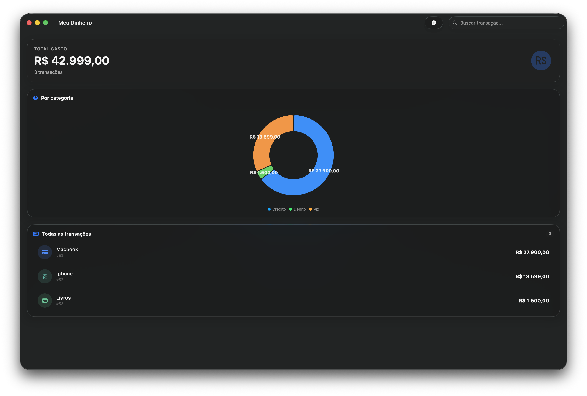
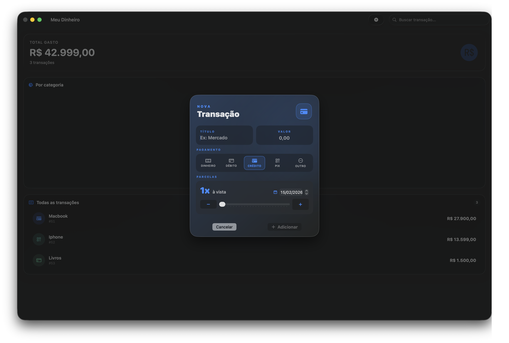
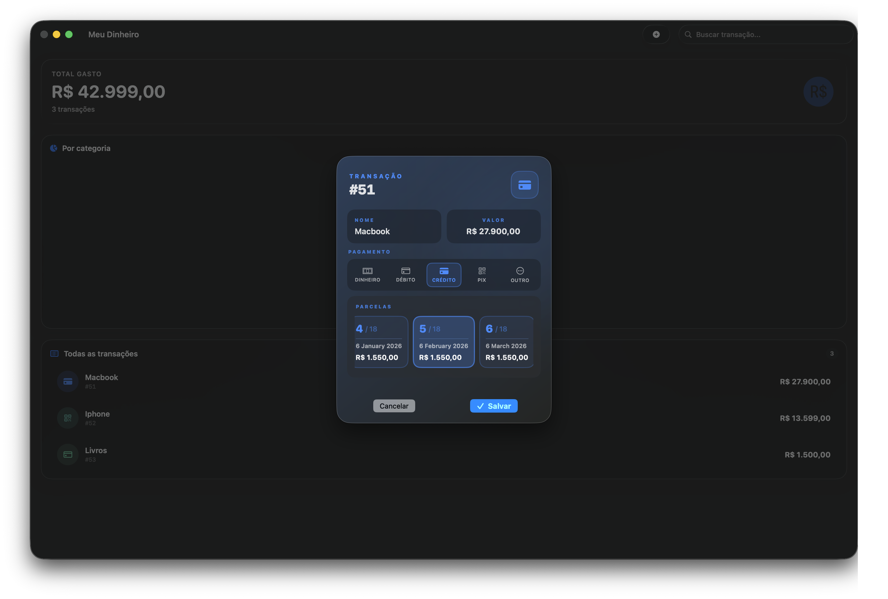

# Vintem

Aplicativo de controle de gastos simples, construído com SwiftUI para macOS e integrado ao Supabase. O app exibe um resumo do total gasto, lista de transações com busca e um gráfico de pizza por tipo de pagamento. Também permite criar novas transações com parcelamento e data de vencimento.

## Screenshots





## Visão geral
- **Plataforma:** macOS (SwiftUI)
- **Persistência/Backend:** Supabase (Postgres + APIs)
- **Gráficos:** Swift Charts
- **Concurrency:** async/await
- **Estado:** ObservableObject + EnvironmentObject
- **Design:** componentes com efeito "glass" (`.glass`, `.glassProminent`, `.glassEffect`)

## Funcionalidades
- Listagem de transações com busca por texto
- Cartão de resumo com o total gasto (BRL)
- Gráfico de pizza por tipo de pagamento (Crédito, Débito, Pix, Dinheiro, Outro)
- Criação de transações com:
  - Título, valor e tipo de pagamento
  - Parcelamento (1x até 24x) com cálculo automático do valor por parcela
  - Data de vencimento inicial das parcelas
- Exclusão de transações (remove parcelas associadas antes)
- Estados de carregamento e erro com ação de "Tentar novamente"

## Pré-requisitos
- macOS 14+
- Xcode 15+
- Uma conta e projeto no Supabase

## Configuração do Supabase

1. Crie um projeto no Supabase e obtenha:
   - `SUPABASE_DB_URL` (ex.: `https://<sua-instancia>.supabase.co`)
   - `SUPABASE_DB_KEY` (chave anon ou service role para desenvolvimento local)

2. Inicialize o Supabase CLI no repositório (caso ainda não tenha feito):
```bash
supabase init
```

2. Faça login no Supabase CLI
```bash
supabase login
```

3. Adicione o seu projeto do Supabase ao Supabase CLI:
```bash
supabase link --project-ref <id_do_projeto>
```

4. Aplique a migration:

   **Localmente:**
```bash
   supabase start
   supabase db reset
```

   **Em produção:**
```bash
   supabase db push
```

5. No Xcode, configure as credenciais em `SupabaseManager.swift`:
```swift
let client = SupabaseClient(
    supabaseURL: URL(string: "SUPABASE_DB_URL")!,
    supabaseKey: "SUPABASE_DB_KEY"
)
```
